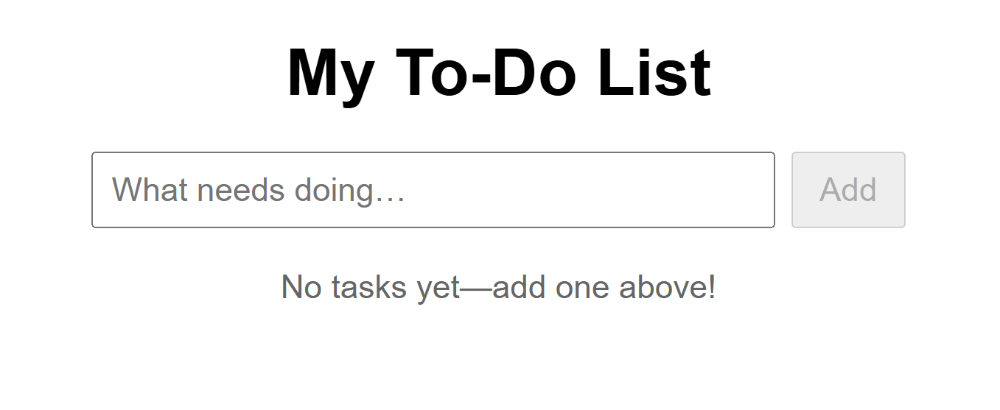

# Cluster Setup

This guide explains how to deploy the `todo-app` into a Kubernetes cluster using Helm.
This approach was chosen to keep the setup **simple, reproducible, and testable**.

---

## Deployment Method

- Helm is used to package and deploy the `todo-app` image hosted on Docker Hub:
  `pavlink1/todo-app-denshi:latest`

- A local Kubernetes cluster is created using **Kind**:
  ```bash
  kind create cluster
  ```

- The application is then deployed into a namespace called `demo`:
  ```bash
  # Navigate to the chart directory
  cd /path/to/your/project/helm-chart
  helm upgrade --install todo-app . --namespace demo --create-namespace
  # Check that the pod is running (might take ~1 min)
  kubectl get pods -n demo
  ```

- The provided `values.yaml` file includes:
  - A `LoadBalancer` service for external access
  - `livenessProbe` and `readinessProbe` on `/` port `3000`

---

## Accessing the Application

Access is tested locally via **port-forwarding**:
```bash
kubectl port-forward svc/todo-app-app 8080:80 -n demo
```

Then open:
```
http://localhost:8080
```

This should confirm that the Helm deployment is working and the app is reachable.



---

